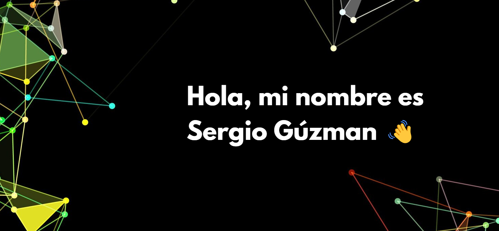

# Estudiante full-stack engineer

Soy estudiante de software desde el 2022

A partir de que me introduje en el mundo de la programación, me enamoré de cada pequeño paso, desde imprimir un simple "Hola Mundo" hasta desplegar un proyecto complejo. La programación es una carrera desafiante, pero sin duda volvería a elegirla, porque el proceso de aprendizaje y creación es increíblemente gratificante. Cada error resuelto, cada función optimizada y cada proyecto completado me llenan de una sensación de logro que pocas cosas pueden igualar. 🚀

Además, la programación no solo me ha enseñado a escribir código, sino también a pensar de manera lógica y estructurada. He aprendido a descomponer problemas complejos en partes más manejables, a ser paciente y persistente, y a valorar el poder de la autonomía y la autogestión. Cada línea de código es una oportunidad para crear algo nuevo y resolver problemas de manera creativa.💻✨

- 🔭 I’m currently working on ...
- 🌱 I’m currently learning ...
- 👯 I’m looking to collaborate on ...
- 🤔 I’m looking for help with ...
- 💬 Ask me about ...
- 📫 How to reach me: ...
- 😄 Pronouns: ...
- ⚡ Fun fact: ...
